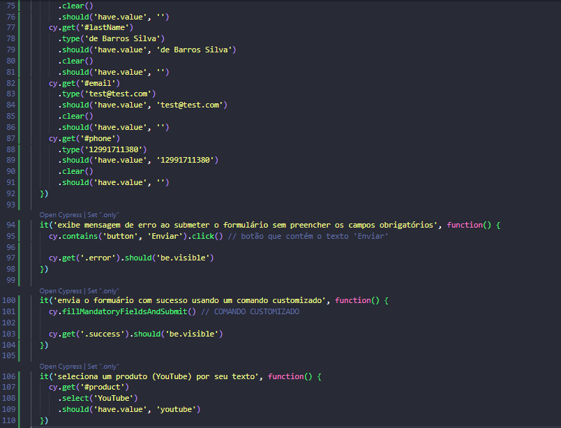

# Talking About Testing | Cypress Básico

 
 > Explorando o Cypress para automação de testes funcionais de Interface Gráfica de Usuário (GUI) e API REST

 Projeto realizado durante o curso **Cypress Básico** da escola online **Talking About Testing**.
 
## 📚 Ferramentas e Tecnologias
 
Como configurar um projeto Cypress do zero
Como visitar páginas locais e remotas
Como lidar com os elementos mais comuns encontrados em aplicações web
Como testar upload de arquivos
Como realizar as mais diversas verificações de resultados esperados
Como criar comandos customizados
Como lidar com links que abrem em outra aba do navegador
Como rodar testes simulando as dimensões de um dispositivo móvel
Como resolver os mesmos problemas de diferentes formas, conhecendo a API do Cypress
Como executar os testes em um pipeline de integração contínua sempre que mudanças ocorrerem no código da aplicação (ou dos testes)

## 🔧 Ferramentas e Tecnologias

- Cypress (`v9.5.1`)
- Node.js (`v16.13.2`)
- npm (`v8.3.2`)
- GitHub Actions (CI/CD)

## 🔧 Instalação

Execute `npm install` para instalar as dependências de dev.

## 🔧 Testes

Você pode executar testes simulando uma viewport desktop ou mobile:

- ### Desktop

	Execute `npm test` para executar o teste no modo headless.

	Ou `npm run cy:open` para executar o teste no modo interativo.

- ### Mobile

	Execute `npm test:mobile` para executar o teste no modo headless.

	Ou `npm run cy:open:mobile` para executar o teste no modo interativo.

## 🔗 Contato

mykallella@gmail.com
