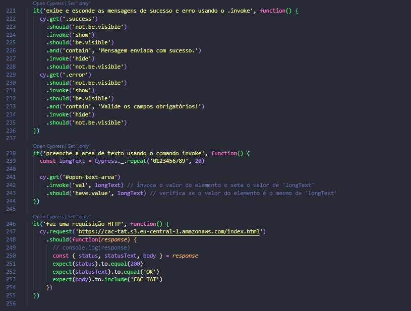

# Talking About Testing | Cypress Básico

https://github.com/user-attachments/assets/38b8eafb-b17e-43d5-b34b-439672ea99a6

https://github.com/user-attachments/assets/c1d1f24f-47fa-4185-a29d-e0d38bb69c8a

> Cypress básico para automação de testes Web - E2E e API REST

 Projeto realizado durante o curso **Cypress Básico** da escola online **Talking About Testing**.
 
## 📚 Tópicos
 
- Como configurar um projeto Cypress do zero
- Como visitar páginas locais e remotas
- Como lidar com os elementos mais comuns encontrados em aplicações web
- Como testar upload de arquivos
- Como realizar as mais diversas verificações de resultados esperados
- Como criar comandos customizados
- Como lidar com links que abrem em outra aba do navegador
- Como rodar testes simulando as dimensões de um dispositivo móvel
- Como resolver os mesmos problemas de diferentes formas, conhecendo a API do Cypress
- Como executar os testes em um pipeline de integração contínua sempre que mudanças ocorrerem no código da aplicação (ou dos testes)

## 🔧 Ferramentas e Tecnologias

- Cypress (`v9.5.1`)
- Node.js (`v16.13.2`)
- npm (`v8.3.2`)
- GitHub Actions (CI/CD)

## 🔧 Instalação

Execute `npm install` para instalar as dependências de dev.

## 🔧 Testes

Você pode executar testes simulando uma viewport desktop ou mobile:

- ### Desktop

	Execute `npm test` para executar o teste no modo headless.

	Ou `npm run cy:open` para executar o teste no modo interativo.

- ### Mobile

	Execute `npm test:mobile` para executar o teste no modo headless.

	Ou `npm run cy:open:mobile` para executar o teste no modo interativo.

## 🔗 Contato

mykallella@gmail.com
